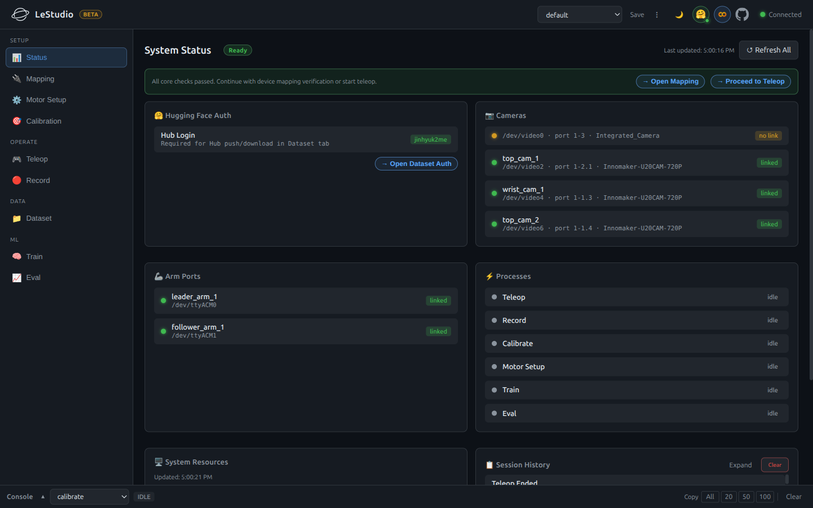
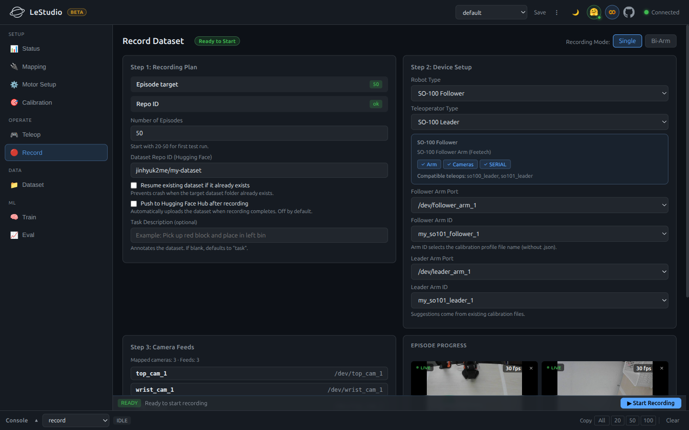
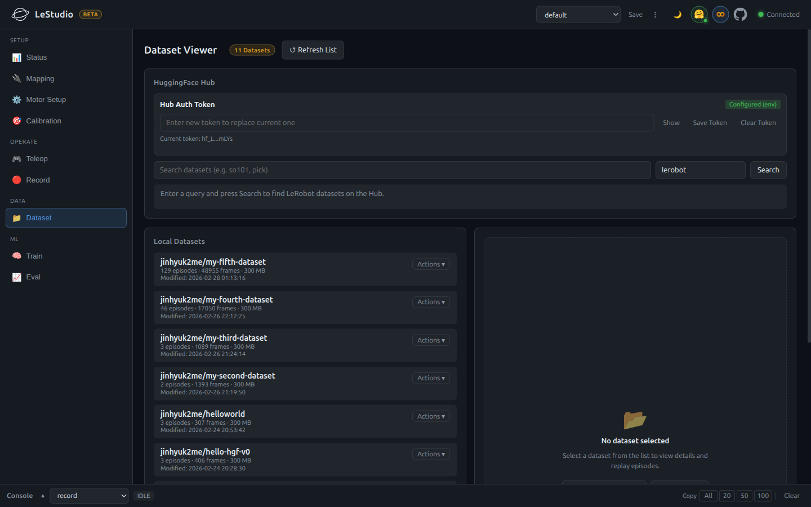
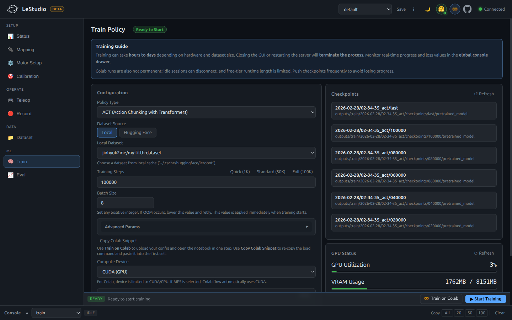

# LeStudio

[](https://github.com/TheMomentLab/lestudio/actions/workflows/ci.yml)
[](https://themomentlab.github.io/lestudio/)
[](LICENSE)
[](https://www.python.org/)

A web-based GUI workbench for [Hugging Face LeRobot](https://github.com/huggingface/lerobot) — covering the full pipeline from hardware setup to policy evaluation. Replaces the CLI-heavy LeRobot workflow with a browser-based interface.

**[Documentation](https://themomentlab.github.io/lestudio/)** · **[Contributing](CONTRIBUTING.md)** · **[Changelog](CHANGELOG.md)** · **[한국어](README.ko.md)**

Architecture docs:

- [Internal Docs Map](docs/README.md)
- [Current Architecture](docs/current-architecture.md)
- [API and Streaming](docs/api-and-streaming.md)

## Screenshots

| Status | Record |
|---|---|
|  |  |

| Dataset | Train |
|---|---|
|  |  |

## Features

### Workbench & Runtime Foundation
- **Workbench Layout**: Sidebar-driven workflow from hardware setup to training and evaluation.
- **Global Console Drawer**: Unified stdout/stderr stream, process input routing, and log copy actions.
- **Responsive Navigation**: Desktop sidebar, tablet icon rail, and mobile drawer layout.
- **Config Profiles**: Save, load, import, export, and delete working configurations.
- **Session History**: Track run-related events across recording, training, and evaluation flows.

### Hardware Setup & Validation
- **Status Dashboard**: Live device and process overview with CPU/RAM/Disk/GPU monitoring.
- **Camera Preview**: MJPEG and snapshot-based camera visibility from the UI.
- **Mapping**: Camera and arm udev rule management, including Arm Identify Wizard.
- **USB Bandwidth Monitoring**: Per-camera FPS, bandwidth, and bus utilization feedback.
- **Motor Setup**: Motor connectivity and setup via `lerobot_setup_motors`.
- **Calibration**: Calibration execution, file management, and delete.
- **Preflight Checks**: Validate devices, calibration, cameras, and CUDA before launch.

### Operation: Teleop & Record
- **Teleop**: Multi-camera teleoperation with preflight checks and live SHM-shared camera feeds.
- **Record**: Episode recording with browser-side episode control, resume support, and preflight checks.

### Dataset & Hub
- **Dataset**: Local dataset listing, detail, delete, and quality checks.
- **Episode Replayer**: Multi-camera synchronized playback with timeline scrubbing.
- **Episode Curation**: Per-episode delete, tag, and filter.
- **Hub Search & Download**: Search and download datasets directly from Hugging Face Hub.
- **Hub Push**: Push local datasets with tracked job progress.

### Training & Evaluation
- **Train**: LeRobot training with CUDA preflight, real-time loss/LR chart, ETA tracking, and hyperparameter presets.
- **Dependency Remediation**: Guided install flows for PyTorch and related training dependencies.
- **Checkpoint Browser**: Scan local checkpoints and auto-link to Eval.
- **Eval**: Policy evaluation with live process output and per-episode result tracking.

### Monitoring & Operator Feedback
- **Runtime Status**: Shared WebSocket status, process stop controls, and orphan-process recovery signals.
- **System Monitoring**: GPU and system resource visibility from the UI.
- **Error Translation**: Common raw process failures converted into operator-readable guidance.
- **Desktop Notifications**: Browser notifications on process completion or error.
- **Dark/Light Theme**: CSS variable-based theme toggle.

## Requirements

- Python 3.10+
- Linux (for `udev` rules and `/dev/video*` access)
- `huggingface/lerobot` installed in your environment

### Optional

- **udev apply**: one-click install works with either passwordless `sudo` or a desktop Polkit auth prompt (`pkexec`). In headless/SSH environments without those, LeStudio provides manual commands.
- **Hub push / download**: `huggingface-cli login` and a valid token are required.
- **GPU monitoring / CUDA preflight**: CUDA environment and `nvidia-smi` required for full Train diagnostics.

## Installation

Install from source:

```bash
git clone --recursive https://github.com/TheMomentLab/lestudio.git
cd lestudio
# one-time (if needed): conda create -n lerobot python=3.10 -y
conda activate lerobot
make install
```

The [custom lerobot fork](https://github.com/TheMomentLab/lerobot) is tracked as a git submodule. `--recursive` pulls it automatically; `make install` installs both packages in editable mode.

## Usage

```bash
lestudio
```

The server starts at `http://localhost:7860`.

To open a browser automatically on desktop sessions, pass `--browser` (`lestudio --browser` or `lestudio serve --browser`). SSH or headless environments still skip browser opening.

### Command Line Options

```
usage: lestudio [-h] {serve,install-udev} ...

subcommands:
  serve           Start the LeStudio web server (default when no subcommand given)
  install-udev    Install udev rules via sudo (CLI alternative to the web UI)

lestudio serve:
  --port PORT           Server port (default: 7860)
  --host HOST           Server host (default: 127.0.0.1)
  --lerobot-path PATH   Path to lerobot source (auto-detected if installed)
  --config-dir DIR      Config directory (default: ~/.config/lestudio)
  --rules-path PATH     udev rules file (default: /etc/udev/rules.d/99-lerobot.rules)
  --browser             Open a browser automatically on startup
  --no-browser          Deprecated no-op; browser is not opened unless --browser is passed
  --headless            Alias for --no-browser
```

Flags can be passed without explicitly typing `serve` — `lestudio --port 8080` works the same as `lestudio serve --port 8080`.

### Network & CORS

- Default bind is local-only: `127.0.0.1`.
- To expose on LAN, use: `lestudio serve --host 0.0.0.0`.
- When the UI is opened from another machine, use the header `Remote` badge to save the LeStudio session token for that server. A prompt still appears as a fallback on the first state-changing action if no token is stored yet.
- Default CORS allows localhost origins only (`localhost` / `127.0.0.1`).

You can override CORS with environment variables:

```bash
# Comma-separated explicit allowlist
export LESTUDIO_CORS_ORIGINS="http://localhost:7860,https://studio.example.com"

# Optional regex override (used when explicit origins are not set)
export LESTUDIO_CORS_ORIGIN_REGEX='^https://(localhost|127\\.0\\.0\\.1)(:\\d+)?$'
```

For development compatibility only, `LESTUDIO_CORS_ORIGINS="*"` is supported but not recommended for shared networks.

## Development

```bash
conda activate lerobot
```

For contributor verification commands (`ruff`, `mypy`, pytest coverage helpers), install dev extras once:

```bash
make dev
```

Backend (with auto-reload on file changes):

```bash
lestudio serve --reload
```

Backend checks:

```bash
python -m ruff check src/lestudio
python -m mypy src/lestudio --ignore-missing-imports
python -m compileall -q src/lestudio
make test
```

`make test` scopes pytest to `tests/` and sets `PYTEST_DISABLE_PLUGIN_AUTOLOAD=1`, which avoids unrelated plugins from the ambient environment. The backend CI job runs the same `ruff`, `mypy`, `compileall`, and pytest sequence before merge.

Frontend checks:

```bash
cd frontend
npm ci
npm run lint
npm test -- --run
npm run test:e2e
npm run build
```

`npm run build` emits the frontend bundle to `src/lestudio/static/`, which FastAPI serves directly.

CI runs these checks automatically on every push: `.github/workflows/ci.yml`.

See [CONTRIBUTING.md](CONTRIBUTING.md) for architecture overview, PR guidelines, and the LeRobot import boundary rules.

Hardware smoke checks (real devices only, opt-in):

```bash
make test-hw
```

When a pull request changes user-visible capabilities or top-level product messaging, update `docs/feature-spec.md`, `README.md`, and `README.ko.md` as part of the same change.

## Workflow Guide

1. **Status** — Confirm cameras and arms are visible and process status is healthy.
2. **Motor Setup** — Map devices to stable symlinks (udev rules), identify arms, run motor setup, and calibrate.
3. **Camera Setup** — Verify camera streams and USB bandwidth.
4. **Teleop** — Validate motion and camera feeds with preflight checks.
5. **Record** — Capture episodes for your target task.
6. **Dataset** — Inspect episodes, curate data, and push to Hugging Face Hub.
7. **Train** — Start training and monitor loss/metrics in real time.
8. **Eval** — Run policy evaluation to close the loop.

## License

Apache 2.0 — see [LICENSE](LICENSE).
